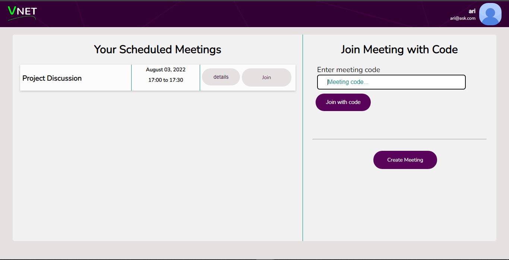

# **VNET MEETINGS FRONTEND**
VNET is a video conferencing web application. It's main feature is that if users are on the same local network, they can choose to share the downstream video feed from one device on the local network to other devices on the network.

This is the front-end application for VNET meetings. It is a single-page application built in JavaScript using ReactJS. To use it follow the instructions [here](https://github.com/wild-times/vnet-backend#using-this-repository).

## **Content.**
- [Abbreviations](#abbreviations).
- [Working](#workings).
  - [Homepage](#1-homepage).
  - [Setup meeting](#2-set-up-meeting).
  - [Join meeting](#3-join-meeting).
  - [Share streams](#4-sharing-the-streams).
  - [Receive streams](#5-receiving-streams-from-a-peer).
- [How WebRTC works on VNET](#how-the-peer-connection-happens-webrtc).

## **Abbreviations**
- WebRTC - Web Real-time communication.
- SDP - Session Description Protocol.
- ICE - Interactive Connectivity Establishment.
- MDN - Mozilla Developer Network.

## **Workings.**
The application works in the following way (Some of the images may appear blurred/pixalated in some areas to obscure private information);

### **1. Homepage**
This is the page that shows you the meeting you have scheduled or you could opt to enter a code for an existing meeting.
The image below shows the screen when you open the application

### **2. Set up meeting.**
Once you've chosen the meeting or entered a meeting code, the information about the meeting and your ACS identity and token is loaded from the server. The ACS details are sent to ACS for verification. Once verified, the meeting setup page is loaded to choose the camera and microphone.

### **3. Join Meeting.**
Once ready, click <button>proceed to meeting</button> to join the meeting.
The normal meeting page looks like the image below with two joined.

> You're now ready to share with a person in your network.

### **4. Sharing the streams.**
To share your stream with a person in the same network, click <button>share with peer</button>. This opens a dialog.

Click the <button>start sharing</button> button to generate a random code, that your peer will enter on their screen.

The code circled here, `546972`, will be copied by the peer as described below.

### **5. Receiving streams from a peer.**
To receive streams from a sharing peer, click on <button>receive from peer</button> then enter the code in the form and click <button>connect</button>. The connection shall happen automatically and streams will display automatically once the connection has been established.

Once received, the streams will be bordered by a different colour from normal streams as shown below. The number of streams via peer is displayed below.

## **How the Peer connection happens (WebRTC).**
[✨ MDN](https://developer.mozilla.org/en-US/docs/Web/API/WebRTC_API 'WebRTC API') defines WebRTC (Web Real-Time Communication) as a technology that enables Web applications and sites to capture and optionally stream audio and/or video media, as well as to exchange arbitrary data between browsers without requiring an intermediary. According to [✨ webrtc.org](https://webrtc.org/ 'Real-time communication for the web'), with WebRTC, you can add real-time communication capabilities to your application that works on top of an open standard. It supports video, voice, and generic data to be sent between peers, allowing developers to build powerful voice- and video-communication solutions. The technology is available on all modern browsers as well as on native clients for all major platforms. The technologies behind WebRTC are implemented as an open web standard and available as regular JavaScript APIs in all major browsers.

A WebRTC application will usually go through a common application flow. Accessing the media devices, opening peer connections, discovering peers, and start streaming. So does VNET.

Any WebRTC application does however require a server to act as an intemediary to allow the clients to resolve on how to connect directly. Explained by [✨ MDN](https://developer.mozilla.org/en-US/docs/Web/API/WebRTC_API/Signaling_and_video_calling#the_signaling_server 'The signaling server'). VNET's signal server is described [here](https://github.com/wild-times/vnet-backend#b-signalling-for-peer-to-peer-connection 'Signalling for peer-to-peer connection'), all we need is a randomly generated six-digit code to connect to the signalling server.

The image below visuallizes how two clients (host & receiver) use VNET's signalling server to connect to each other;

The following events happen allowing devices to connect;

1. **The host client generates a random six-digit code**. This code is shared with the receiver manually. Eg. `121421`. The code is generated by clicking the <button>start sharing</button> as seen [above](#4-sharing-the-streams).
2. **The host then connects to VNET's signalling server on the endpoint**: `ws://vnet.com/vnet/ps/121421/`. It is important to note that only two clients are allowed on the endpoint by the signal server.
3. **The receiver client gets the code manually from the host client** and enter the code into the form given as seen [above](#5-receiving-streams-from-a-peer).
4. **Using the code, the receiver connects to the endpoint on the signalling server, same as host**: `ws://vnet.com/vnet/ps/121421/`.
5. Once both clients are connected, no more clients can join in. They are blocked by the server. **The server then broadcasts a message to both clients telling them that they can now start negotiating/signalling for a WebRTC connection.**
6. **The host, being the host, begins by creating an offer message**. The offer is sent to the signalling server. An offer message is a type of [✨ SDP](https://developer.mozilla.org/en-US/docs/Glossary/SDP 'MDN: SDP') message: *It is the standard describing a peer-to-peer connection. SDP contains the codec, source address, and timing information of audio and video.*
7. **The signalling server forwards the offer to the receiver.**
8. **The receiver accepts the offer and saves it. Then generates an answer**, another type of SDP, and sends it to the signalling server.
9. **The answer is forwared by the signalling server to the host** where it's saved.
10. Almost simultaneously, the host and receiver are **generating ICE candidates**, sending them to the signalling server, then being forwared to the other where they are saved. *According to [✨ MDN](https://developer.mozilla.org/en-US/docs/Web/API/RTCIceCandidate 'RTCIceCandidate'), an ICE candidate describes the protocols and routing needed for WebRTC to be able to communicate with a remote device. When starting a WebRTC peer connection, typically a number of candidates are proposed by each end of the connection, until they mutually agree upon one which describes the connection they decide will be best. WebRTC then uses that candidate's details to initiate the connection*.
11. Once a route has been established, the clients connect direclty without need for the signalling server.
12. The host collects the streams on it's end and shares them. The receiver checks the streams on the connection and displays them.
13. Every 15 seconds, the receiver asks the host if they have new streams, if it does it adds or removes dead streams and if not it does nothing.

&copy; 2022 Wild Times.
